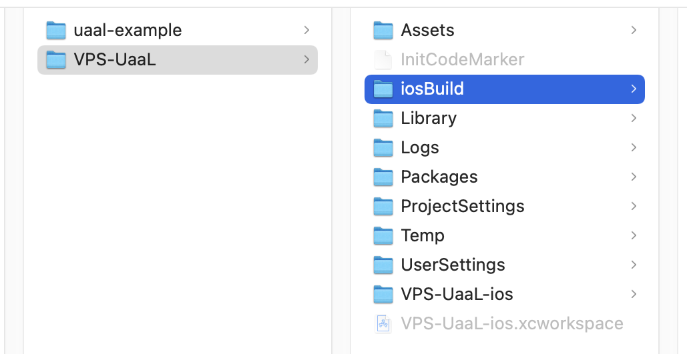

# ARCore Geospatial APIのサンプルをUaaLで動かしてみる

このリポジトリにあるコードは、ARCore Geospatial APIのサンプルシーンをiOSのUnity as a Libraryで動くようにしてみたものです。

ARCore Geospatial APIのサンプルシーンを（普通に）動かす手順は次の記事を参考にしています。  
https://zenn.dev/tkada/articles/04b44474149130

UaaLについては、次のものを参考にしています。  
https://github.com/Unity-Technologies/uaal-example/blob/master/docs/ios.md  
また、これのObjective-Cで書かれている部分をSwift化してみたものが次の場所にあります。  
https://github.com/rakusan/uaal-example/blob/master/docs2/ios-summary.md  

## このリポジトリのコードの動かし方

### GCPの設定を行う
次の記事を参考にしてGCPの設定を行います。認証情報もこの記事と同じくAPIキーを使用します。  
https://zenn.dev/tkada/articles/04b44474149130#gcp%E3%81%AE%E8%A8%AD%E5%AE%9A%E3%82%92%E8%A1%8C%E3%81%86

### リポジトリのチェックアウト
```git clone https://github.com/rakusan/VPS-UaaL.git```

### Unityプロジェクトのビルド
チェックアウトしたリポジトリをUnity Editorで開いてビルドします。  
ビルドの出力ディレクトリは ```VPS-UaaL/iosBuild``` とします。  

