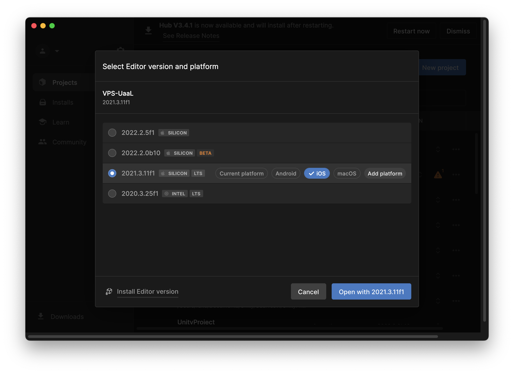
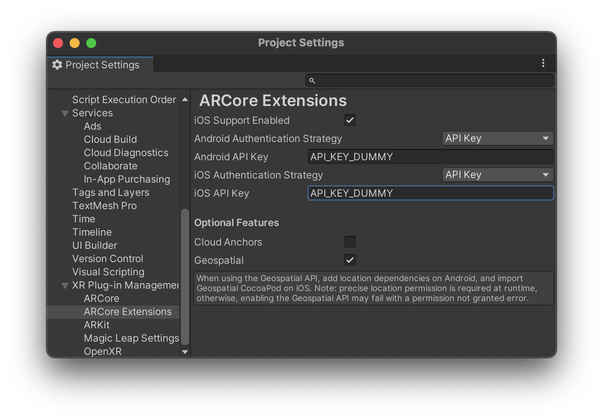
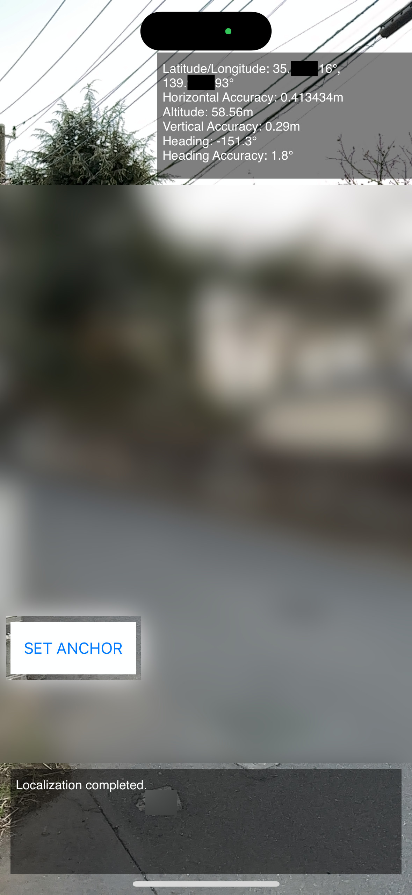

# ARCore Geospatial APIのサンプルをUaaLで動かしてみる

このリポジトリにあるコードは、ARCore Geospatial APIのサンプルシーンをiOSのUnity as a Libraryで動くようにしてみたものです。

ARCore Geospatial APIのサンプルシーンを（普通に）動かす手順は次の記事を参考にしています。  
https://zenn.dev/tkada/articles/04b44474149130

UaaLについては、次のものを参考にしています。  
https://github.com/Unity-Technologies/uaal-example/blob/master/docs/ios.md  
また、これのObjective-Cで書かれている部分をSwift化してみたものが次の場所にあります。  
https://github.com/rakusan/uaal-example/blob/master/docs2/ios-summary.md  

## このリポジトリのコードの動かし方

### GCPの設定を行う
次の記事を参考にしてGCPの設定を行います。認証情報もこの記事と同じくAPIキーを使用します。  
https://zenn.dev/tkada/articles/04b44474149130#gcp%E3%81%AE%E8%A8%AD%E5%AE%9A%E3%82%92%E8%A1%8C%E3%81%86

### リポジトリのチェックアウト
```git clone https://github.com/rakusan/VPS-UaaL.git```

### Unityプロジェクトを開く
チェックアウトしたリポジトリをUnity Editorで開きます。  
開く際にplatformをiOSに変更しておきます（この変更をしないで開いた場合は、SafeModeで開いてからplatformをiOSにします）。


### APIキーの設定
Edit -> Project Settings -> ARCore Extensions の順で設定画面を開いてAPIキーを設定します。  


### Unityプロジェクトのビルド
ビルドします。ビルドの出力ディレクトリは ```VPS-UaaL/iosBuild``` とします。  


### Xcodeプロジェクトの設定
```VPS-UaaL/VPS-UaaL-ios.xcworkspace```をXcodeで開き、次の設定をします。
- ```Unity-iPhone/Libraries/Plugins/iOS/NativeCallProxy.h```のTarget MembershipでUnityFrameworkを選択し、Publicにします。
- ```Unity-iPhone/Data```のTarget MembershipでUnityFrameworkを選択します。
- ```Pods```の Build Settings で Enable Bitcode を Yes にします。

### Xcodeプロジェクトのビルドと実行
VPS-UaaL-iosをビルドし、実行します。

## 画面説明
### 初期画面
Startボタンだけが画面中央にあります。それを押すとアプリ内でUaaLが起動し、ARCore Geospatial APIのサンプルシーンが開始します。

### ARCore Geospatial APIのサンプルシーン
（場所の特定を防ぐために画像は加工してあります）<br>
<br>
カメラの映像（とそれを利用するARCore Geospatial APIの処理）はUnity側で動いています。その上に乗っているUIはiOSネイティブのものになっています。ARCore Geospatial APIのサンプルシーンの元のコードではUIも全てUnity側で動く点が異なります。
